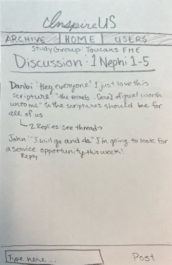
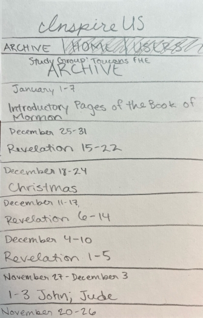
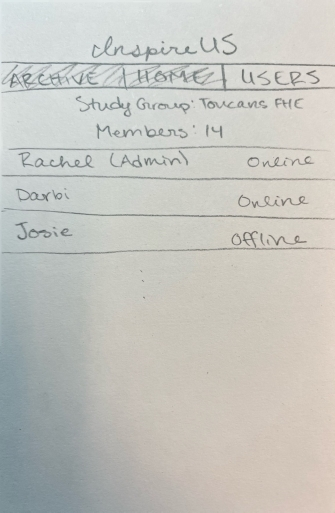

# InspireUS

[Class notes](/notes.md) for use on tests. Update frequently.

## Description Deliverable

### Elevator Pitch

For single BYU students, FHE is usually fun activities, not peer Gospel study. There is little motivation to do _Come, Follow Me_ because there's no one to share what you learn with. InspireUS fills that need. InspireUS is a peer collaboration app that opens a new discussion each week based on that week's _Come, Follow Me_. It allows users to start threads about specific scriptures and share the insights they've learned in real time. InspireUS encourages scripture study and spiritual conversations all week!

### Design

#### Home (Discussion)

#### Archive

#### Users

### Key Features
- Secure login over HTTPS
- Ability to join a study group
- New discussion each week
- Users submit scriptures and thoughts to talk about
- Previous discussions are archived and can be accessed
- Ability to see who is online
- User receives notifications when someone replies to their thread
- Peer-to-peer communication
- Can see and join any thread

### Technologies

The required technologies will be met as follows:

- **HTML:** Uses correct structure. Four pages: login (with study group), main discussion, archived discussions, who's online.
- **CSS:** Style the pages for web and phone screens, everything looks clean, appropriate colors and contrast.
- **JavaScript:** Login, navigating pages, populating the discussion, replying, display online status.
- **Service:** Backend service with endpoints for:
  - login
  - writing user messages
  - replying to other users
  - retrieving online status
  - retriving archived discussions
  - accessing scripture references from third-party server
- **DB/Login:** Store users and study groups in database. Register and login users. Credentials stored securely in database. Cannot see discussions unless authenticated.
- **Websocket:** When users post or reply, all other users in the study group can see it.
- **React:** Application ported to use the React web framework.

## HTML Deliverable
- **HTML Pages:** four html pages: index.html with login, discussion.html with the main discussion functionality, archive.html where links to past discussions will be stored (these links do not work yet), users.html with the members of the study group, their online status, and an image.
- **Links:** each page has links to the others, excluding the login page. There is also a link to this repository on each page.
- **Text:** placeholder text for discussion titles (based on Come, Follow Me for that week) and users' posts is present. Placeholder archived discussion titles also present.
- **3rd Party Service Calls:** placeholders for posted messages, online status, login, archived discussions
- **Images:** my application is not based around images, so the only one I included was for decoration on the users.html page.
- **Login Placeholder:** index.html contains a login form, users' names are displayed when they post a message and on the users.html page.
- **Database:** placeholder text for a box that would appear on hover over a user's scripture reference containing the reference retrieved from a database, placeholder for discussion titles, image may be a placeholder or it may stay the same.
- **WebSocket:** placeholder for realtime discussions, number of users in study group, and online status.

## CSS Deliverable

I deployed the simon css at [simon.inspireus.click](https://simon.inspireus.click).

- **Header, Footer, and Main Content Body:** Formatted the application to look like my initial design with some modifications. The header and footer disappear to save space when the vertical height of the viewport is small enough. Headers and footers stay where they should.
- **Navigation Elements:** I implemented a header with navigation to the archive, home (discussion), and users pages. This header is not visible on the index.html page because the user needs to log in before they can access their study group's discussion
- **Responsive to Window Resizing:** Application dynamically resizes to device dimensions and looks good (unless the screen is extremely small).
- **Application Elements:** Implemented a color scheme with good contrast, the page layout and whitespace is visually pleasing, the scripture reference sidebar cannot be seen (it is -250px off the discussion page to the right), but it is formatted correctly and ready to be deployed with javascript.
- **Application Text Elements:** Font and font size consistent and readable. Font weight is used appropriately.
- **Application Images:** The only image in my application is on the Users page. It is formatted as the background for the page title and positioned and sized as a banner, as intended.

## JavaScript Deliverable

I deployed the simon javascript at [simon.inspireus.click](https://simon.inspireus.click).

- **Login:** Fields for name and password, name is currently saved to localStorage, pressing 'login' takes the user to the discussion.html page.
- **Database:** The name of the discussion will change weekly based on that week's Come, Follow Me, but for now, it changes daily based on the date. Clicking on a scripture reference of the form 'book #:#' will bring up a sidebar which will eventually show the verses from a database. Currently, it shows the scripture reference and verse numbers with placeholder text. Several items are currently in localStorage but will eventually be in the server's database.
- **Websocket:** User can display their own messages. A setInterval function periodically displays a single message. On the 'users' paage, all users that have ever logged in are shown in a table as 'online'. These will be replaced with websocket functionality, when I can track if a user is online or not. 
- **Application Logic:** Messages are stored and retrieved dynamically. The content of a message matching a regex pattern gets wrapped with javascript that opens the sidebar when clicked, which updates depending on the element that was clicked. After a day, the discussions are saved in localStorage and can be viewed in the archive. (Since this is functional, I removed all placeholders in the Archive page. If a day has not passed, localStorage will not have updated, so this part will appear blank. It is not central to my app's functionality.) Names and study group names are saved in localStorage and updated accross the app.

## Service Deliverable

Simon service deployed.

- **HTTP Service:** Complete!
- **Static Middleware for Frontend:** Complete!
- **3rd Party Enpoints on Frontend:** Complete! My app calls two different apis for the bible and the Book of Mormon. Unfortunately, there was not an api available for all the standard works, so there's no support for D&C, JS-History, or the Pearl of Great Price. I also had originally planned to get the weekly scriptures as the discussion name, but there is no api for that, so right now it is a discusison that refreshes and archives every day. I may end up changing it to weekly, but that hasn't been done yet.
- **Backend Service Endpoints:** I added the data that would be needed server-wide from the localStorage to the service and provided enpoints for that. This includes the messages that are displayed, meaning the chat has functionality! There are also endpoints for a list of user objects, which includes online status. This is a placeholder for webSocket.
- **Frontend Calls Service Endpoints:** GET and POST requests made using fetch and async/await to store and retrieve the data on the server.

## Database/Login Deliverable

- **New User Registration:** created a new html page for registration. Users are stored in mongoDB with encrypted passwords. New users must register before logging in.
- **Existing User Authentication:** using bcrypt, passwords must match. Names must also match the name stored with the email in the database for users to login.
- **Stores Application Data in MongoDB:** users, study group names, and the list of messages associated with each day are stored in MongoDB.
- **Stores and Retrieves Credentials in MongoDB:** users, along with their passwords and tokens, are stored in MongoDB and retrieved upon login, logout, and accessing endpoints in the application.
- **Restricts Functionality:** on frontend, users cannot access the application without first logging in, which requires authentication. On backend, all endpoints other than those used for registration and logging in cannot be accessed without a token. 

## Websocket Deliverable

- **Backend Listens for Websocket Connection:** Done! The backend listens for websocket connections and messages.
- **Frontend Makes Websocket Connection:** Done! Each main javascript page after login (discussion.js, users.js, archive.js, and archive-discussion.js) includes code to open a connection when the page is loaded and close it when it is closed.
- **Data Sent Over Websocket Connection:** Done! Messages are sent over websocket when a user sends a message, and the users' statuses (online or offline) are sent from the backend to the frontend (users.js) after the database has been updated.
- **Websocket Data Displayed:** Done! The messages are displayed on each session, and the status messages display a table with the status of each user. This table only updates when the page is refreshed, but this is intentional.

## React Deliverable

NOTE: I have not implemented the entire application. I technically have all the requirements, but the actual chat and archive do not work. 

- **Bundled Using Vite:** Complete!
- **Multiple Functional React Components:** Complete! I have functional app (which contains logout), login, and users components.
- **React Router:** Complete! Used to switch between pages when logging in and out, also used in navigation header after logging in.
- **React Hooks:** Complete! Used UseState in all components and useEffect in the users component. 
