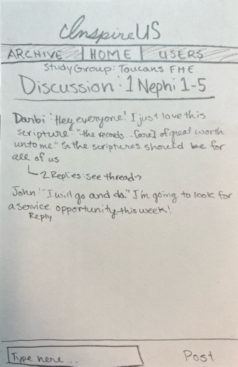
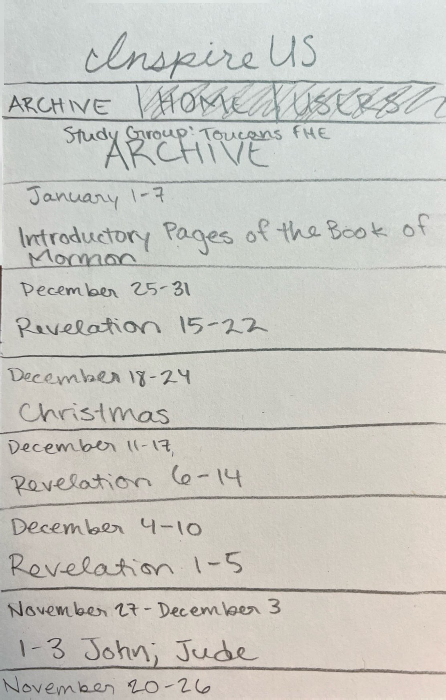
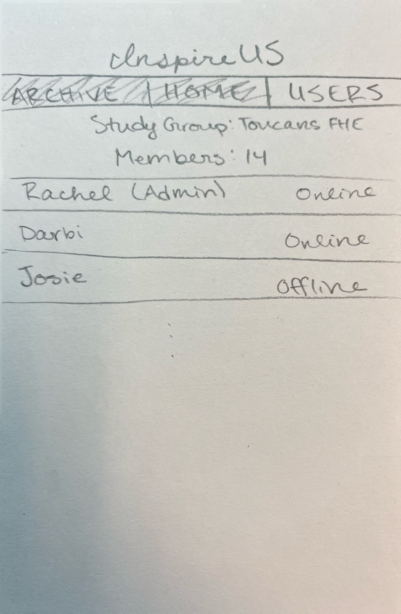

# InspireUS

[Class notes](/notes.md) for use on tests. Update frequently.

## Description Deliverable

### Elevator Pitch

For single BYU students, FHE is usually fun activities, not peer Gospel study. There is little motivation to do _Come, Follow Me_ because there's no one to share what you learn with. InspireUS fills that need. InspireUS is a peer collaboration app that opens a new discussion each week based on that week's _Come, Follow Me_. It allows users to start threads about specific scriptures and share the insights they've learned in real time. InspireUS encourages scripture study and spiritual conversations all week!

### Design

#### Home (Discussion)

#### Archive

#### Users

### Key Features
- Secure login over HTTPS
- Ability to join a study group
- New discussion each week
- Users submit scriptures and thoughts to talk about
- Previous discussions are archived and can be accessed
- Ability to see who is online
- User receives notifications when someone replies to their thread
- Peer-to-peer communication
- Can see and join any thread

### Technologies

The required technologies will be met as follows:

- **HTML:** Uses correct structure. Four pages: login (with study group), main discussion, archived discussions, who's online.
- **CSS:** Style the pages for web and phone screens, everything looks clean, appropriate colors and contrast.
- **JavaScript:** Login, navigating pages, populating the discussion, replying, display online status.
- **Service:** Backend service with endpoints for:
  - login
  - writing user messages
  - replying to other users
  - retrieving online status
  - retriving archived discussions
  - accessing scripture references from third-party server
- **DB/Login:** Store users and study groups in database. Register and login users. Credentials stored securely in database. Cannot see discussions unless authenticated.
- **Websocket:** When users post or reply, all other users in the study group can see it.
- **React:** Application ported to use the React web framework.

## HTML Deliverable
- **HTML Pages:** four html pages: index.html with login, discussion.html with the main discussion functionality, archive.html where links to past discussions will be stored (these links do not work yet), users.html with the members of the study group, their online status, and an image.
- **Links:** each page has links to the others, excluding the login page. There is also a link to this repository on each page.
- **Text:** placeholder text for discussion titles (based on Come, Follow Me for that week) and users' posts is present. Placeholder archived discussion titles also present.
- **3rd Party Service Calls:** placeholders for posted messages, online status, login, archived discussions
- **Images:** my application is not based around images, so the only one I included was for decoration on the users.html page.
- **Login Placeholder:** index.html contains a login form, users' names are displayed when they post a message and on the users.html page.
- **Database:** placeholder text for a box that would appear on hover over a user's scripture reference containing the reference retrieved from a database, placeholder for discussion titles, image may be a placeholder or it may stay the same.
- **WebSocket:** placeholder for realtime discussions, number of users in study group, and online status.

## CSS Deliverable

I deployed the simon css at [simon.inspireus.click](simon.inspireus.click).
